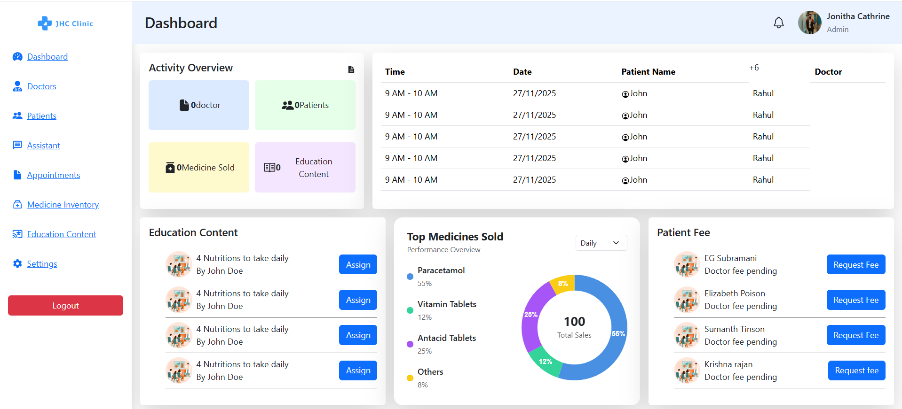
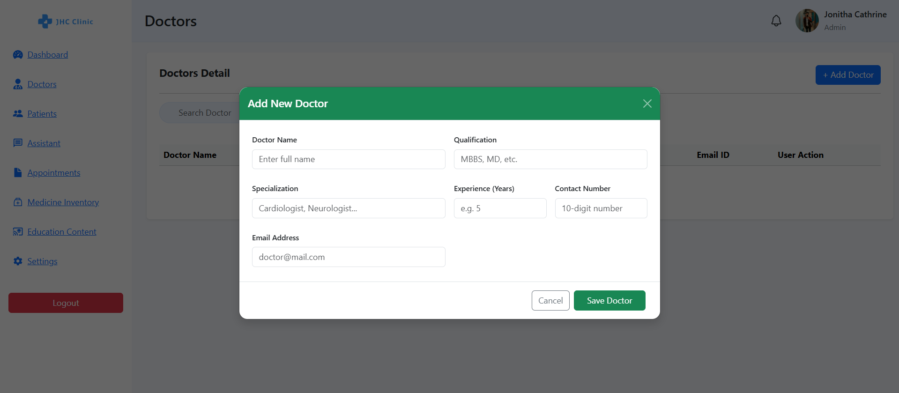
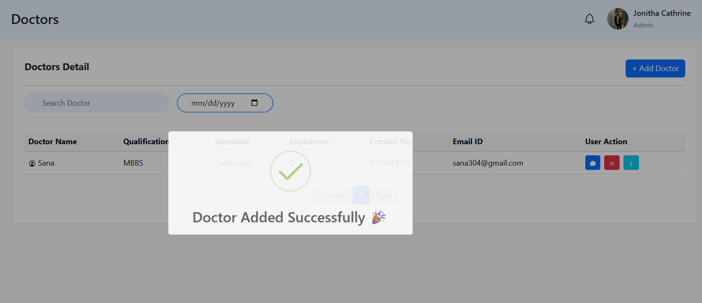
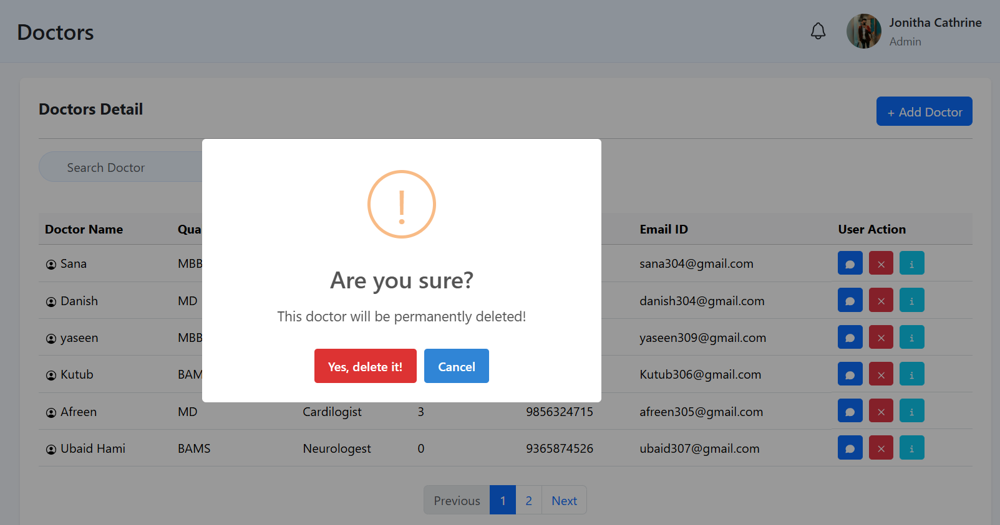
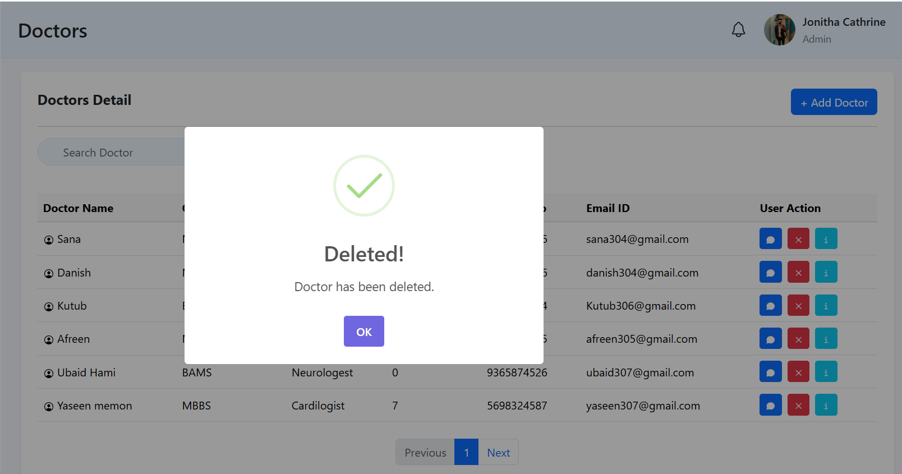
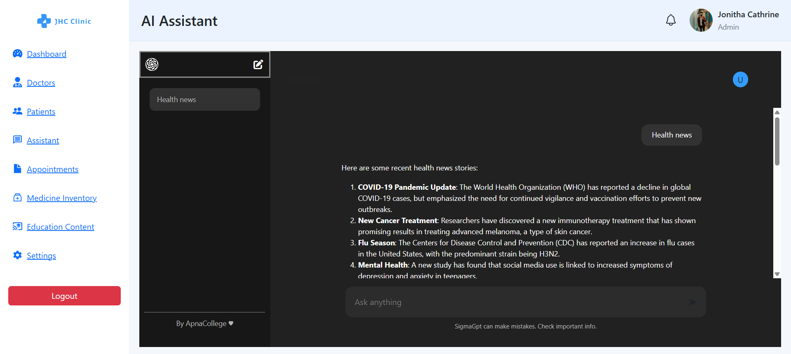

🚀 <strong><u>Hospital Management Software</u></strong> 
💻 <strong><u>Note:</u></strong> This application is designed for <b>desktop/laptop use only</b> and is intended for <b>hospital staff and doctors</b> to manage operations efficiently. 

Hospital Management Software is a full-stack web application designed to manage hospital operations efficiently.
It includes modules for doctors, patients, appointments, inventory, and basic AI assistant support.

✨ <strong><u>The application supports</u></strong> 
-🔐 Secure authentication system (Login / Signup) 
-👨‍⚕️ Doctor management (CRUD operations) 
-📊 Dashboard overview 
-📅 Appointment management 
-💊 Medicine inventory tracking 
-📚 Education content module 
-🤖 AI Assistant (basic integration) 

🎯 <strong><u>My Contribution</u></strong> 
-🔐 Implemented complete JWT Authentication system (Login / Signup) 
-👨‍⚕️ Developed Doctor Module (Add, Update, Delete, View Doctors) 
-🛡️ Protected Routes using middleware (Frontend + Backend) 
-🤖 Integrated basic AI Assistant module 

✨ <strong><u>Key Features</u></strong> 
-🔐 JWT-based Authentication & Authorization 
-👨‍⚕️ Doctor Management System (CRUD APIs) 
-📊 Dashboard with activity overview 
-📅 Appointment tracking system 
-💊 Medicine inventory management 
-📱 Responsive UI design 
-⚡ REST APIs using Express.js 

🛠 <strong><u>Tech Stack</u></strong> 
<b><u>Frontend:</u></b> 
-React (Vite) 
-JavaScript (ES6+) 
-Bootstrap + CSS 
-React Router DOM 
-Chart.js 

<strong><u>Backend:</u></strong> 
-Node.js 
-Express.js 
-MongoDB 
-Mongoose 
-JWT Authentication 
-bcryptjs 

🔐 <strong><u>Authentication Flow</u></strong> 
-User registers or logs in 
-JWT token generated on backend 
-Token stored in localStorage 
-Protected routes accessed using Bearer Token 

👨‍⚕️ <strong><u>Doctor Module</u></strong> 
-Add new doctor 
-Update doctor details 
-Delete doctor 
-View all doctors 

## 📸 <strong><u>Usage Screenshots</u></strong>

<table>
  <tr>
    <td align="center">
       
      <b>Login Page</b>
    </td>
    <td align="center">
       
      <b>Dashboard Page</b>
    </td>
  </tr>

  <tr>
    <td align="center">
       
      <b>Doctor Info Add Form</b>
    </td>
    <td align="center">
       
      <b>Doctor Page Module</b>
    </td>
  </tr>

  <tr>
    <td align="center">
       
      <b>Delete Alert Permission</b>
    </td>
    <td align="center">
       
      <b>Doctor Delete Successfull</b>
    </td>
  </tr>

  <tr>
    <td align="center">
       
      <b>Chat Threads</b>
    </td>
  </tr>
</table>

⚙️ <strong><u>Environment Variables</u></strong> 
-Create a .env file inside Backend: 
-PORT=3000 
-DATABASE_URL=your_mongodb_url 
-JWT_SECRET=your_secret_key 

🚀 <strong><u>Installation & Setup</u></strong> 
<strong>1) Clone Repository:</strong> 
-git clone https://github.com/YaseenMotlani/hospital_management_system.git
 
-cd hospital-management-system 

<strong>2) Backend Setup:</strong> 
-cd Backend 
-npm install 
-npm start 

<strong>3) Frontend Setup:</strong> 
-cd Frontend 
-npm install 
-npm run dev 

🔮 <strong><u>Future Enhancements</u></strong> 
-💳 Online payment integration 
-📊 Advanced dashboard analytics 
-📱 Mobile responsive improvements 

📄 <strong><u>License</u></strong> 
-MIT License 

👤 <strong><u>Author</u></strong> 
-<strong><ul>Yaseen Motlani</ul></strong> 
-<strong>GitHub:</strong> https://github.com/YaseenMotlani  
-<strong>Live Demo:</strong> https://hospital-management-system-f.onrender.com 